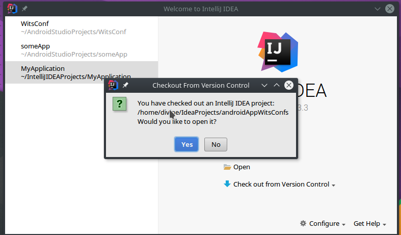

# Android App
#### we will  be coding this app at the wits meet up on the 25th from 13:00 to 14:00 please come with your laptop because we will be coding together and helping each other at the same time.

what this app is that it has a spinner aka dropdown menu, where you can select your favorite language and then it can show you the
best IDE for your favorite language. we will learn alot from this app from this app you will also be able to create your own android application
with buttons input text, toasts and lists, and load data from a data source and... u will be ,learning java as well app looks like this:

   

# Tools to pre download 
 
 
 * we will be using **[IntelliJ](https://www.jetbrains.com/student)** because it is faster than android studio and offers other great features as you will see at the meetup and android studio is built on IntelliJ
    * you can download it [here](https://www.jetbrains.com/idea/) get The ultimate one and the get your student licence key [here](https://www.jetbrains.com/student)  
 * You will need the [jdk](http://www.oracle.com/technetwork/java/javase/downloads/jdk8-downloads-2133151.html)
 * How to install [click here](http://docs.oracle.com/javase/7/docs/webnotes/install/windows/jdk-installation-windows.html#path)
    * JDK download url [click here](http://www.oracle.com/technetwork/java/javase/downloads/jdk8-downloads-2133151.html)
    * look very carefully at [Updating your path variables](http://docs.oracle.com/javase/7/docs/webnotes/install/windows/jdk-installation-windows.html#path)
    
    
 
# Downloading the application to your computer

after you have the IntelliJ and installed the JDK open intelliJ  do these->

link to paste in Github repo URL is (https://github.com/divine13/androidAppWitsConf.git)

#Problems
if you get any error while trying to run this app please add an issue on [YouTrack issues Tracker](http://store.myjetbrains.com/youtrack/issues?q=project:%20MeetUps#newissue)  or email me on my email dubedivine@gmail.com
 
if you get a **JAVA_HOME** not defined error checkout this link [here](https://confluence.atlassian.com/doc/setting-the-java_home-variable-in-windows-8895.html)
 * the default directory of your java installation is at C:\Program Files\Java\jdkXXX
 

 
 
